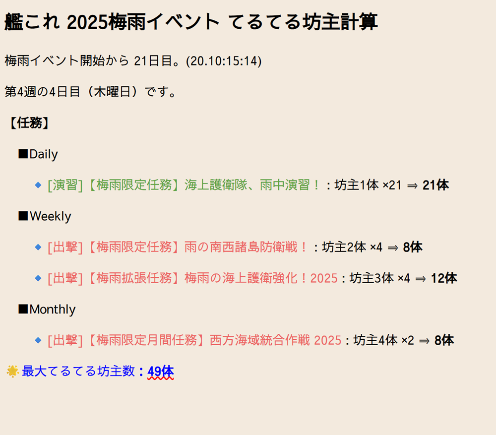

# kc_tuyu2025 - 艦これ「梅雨」イベント報酬確認ツール

艦隊これくしょん（艦これ）の2025年「梅雨」イベント用の報酬確認ツールです。  
任務の進捗と報酬の個数を整理しながら、残数を管理できます。  

## 📦 機能概要

- 任務ごとの報酬内容を確認
- 報酬数や残数の集計を自動で表示

## 📁 使用方法

1. このリポジトリをクローンします。
2. `index.html` をブラウザで開くだけで使えます。
3. 任務と報酬の情報を入力し、進捗管理にご利用ください。

## 📜 ライセンス

MITライセンスです。詳細は [LICENSE](./LICENSE) を参照してください。

## 🖼 スクリーンショット

## 🙋‍♂️ 製作者

UG.
